# yfinance-analytics-stack

Bem-vindo à documentação oficial do **yfinance-analytics-stack**! Este projeto é uma plataforma automatizada de Engenharia de Dados voltada para a captura, transformação e disponibilização de métricas financeiras das principais ações do mercado (AAPL, AMZN, GOOGL, MSFT, NVDA).

---

## Arquitetura de Dados

O projeto segue os princípios da **Medallion Architecture** (Camadas Bronze, Silver e Gold), garantindo organização, rastreabilidade e performance:

```mermaid
    graph TD
    %% Definição de Estilos Gerais
    classDef default fill:#111216,stroke:#30363d,stroke-width:1px,color:#e6edf3;
    classDef highlight fill:#1f6feb,stroke:#58a6ff,stroke-width:2px,color:#ffffff;
    classDef bronze fill:#8b5a2b,stroke:#a0522d,stroke-width:1px,color:#ffffff;
    classDef silver fill:#708090,stroke:#778899,stroke-width:1px,color:#ffffff;
    classDef gold fill:#d4af37,stroke:#b8860b,stroke-width:1px,color:#ffffff;

    %% Nós Principais do Pipeline
    Airflow[Apache Airflow] --->|Ingestão Diária| Python[Python / yfinance]
    Python --> Postgres[PostgreSQL Local]
    Postgres --> DBT[dbt Transformação]

    %% Divisão da Arquitetura Medallion
    DBT --> Bronze
    DBT --> Silver
    DBT --> Gold

    %% Sub-estruturas de detalhes de cada Camada
    subgraph Bronze [Camada BRONZE]
        B_Desc[Ingestão Incremental Inteligente]
        B_Schema[Schema: public.stocks]
    end

    subgraph Silver [Camada SILVER]
        S_Desc[Limpeza e Tipagem dos Dados]
        S_Schema[Schema: public_silver]
    end

    subgraph Gold [Camada GOLD]
        G_Desc[Métricas de Negócio: Retorno, Volatilidade e Liquidez]
        G_Schema[Schema: public_gold]
    end

    %% Aplicação dos Estilos nos Componentes
    class Airflow,Python highlight;
    class Postgres,DBT default;
    class Bronze,B_Desc,B_Schema bronze;
    class Silver,S_Desc,S_Schema silver;
    class Gold,G_Desc,G_Schema gold;

    %% Ajustes visuais do Subgraph
    style Bronze fill:#1a1512,stroke:#8b5a2b;
    style Silver fill:#14171a,stroke:#708090;
    style Gold fill:#1a1912,stroke:#d4af37;
```



---

## Tecnologias Utilizadas

* **Orquestração:** [Apache Airflow (Astro CLI)](https://airflow.apache.org/) - Gerencia o agendamento diário, controle de variáveis de execução e fluxo da pipeline.
* **Coleta de Dados:** [yfinance](https://github.com/ranaroussi/yfinance) - Scripts em Python utilizando Pandas para consumo otimizado da API do Yahoo Finance.
* **Transformação & Modelagem:** [dbt (data build tool)](https://www.getdbt.com/) - Engenharia de transformações SQL, testes de qualidade de dados e documentação do lineage.
* **Banco de Dados:** [PostgreSQL 16](https://www.postgresql.org/) - Banco de dados relacional rodando localmente em container para o Data Warehouse.
* **Visualização:** [Streamlit](https://streamlit.io/) - Dashboard interativo em Python consumindo a camada Gold para análise de indicadores.
* **Administração do Banco:** [pgAdmin 4](https://www.pgadmin.org/) - Interface web para gerenciamento e consultas rápidas ao ecossistema PostgreSQL.

---

## Pré-requisitos e Como Rodar o Projeto

### 1. Pré-requisitos Básicos
Antes de iniciar, certifique-se de ter instalado em seu ambiente de desenvolvimento:
* **Git** (Para clonagem do repositório)
* **Docker Engine** v20.10+
* **Docker Compose** v2.0+

### 2. Clonando o Repositório
Abra o terminal na pasta onde deseja salvar o projeto e execute o comando abaixo para realizar o clone da aplicação:

```bash
git clone https://github.com/Almeida-Adriel/yfinance-analytics-stack.git
```

### 3. Navegue até a raiz do projeto
```bash
cd yfinance-analytics-stack
```

### 4. Configurando as Conexões
Para que os containers se comuniquem corretamente com o seu banco de dados, utilize os arquivos de exemplo disponibilizados na raiz do projeto como guia:

 - Copie o arquivo ./example.env para um novo arquivo chamado .env e preencha com as suas credenciais do seu banco de dados em nuvem ou o local.
        ```bash
        cp example.env .env
        ```

 - Mapeie o arquivo de credenciais do dbt (profiles.yml) apontando para o seu banco conforme o modelo em ./profiles-example.yml.

### 5. Inicializando a Infraestrutura (Docker Compose)
```bash
docker-compose up -d
```

### 6. Portais de acesso disponiveis
| Serviço / Aplicação | URL Local | Credenciais de Acesso |
| :--- | :--- | :--- |
| **Apache Airflow Webserver** | [http://localhost:8080](http://localhost:8080) | Usuário: `admin` \| Senha: `admin` |
| **Banco de Dados pgadmin** | [http://localhost:8080](http://localhost:5050) | Usuário: `admin@admin.com` \| Senha: `admin` |
| **dbt Docs (Portal Interativo)** | [http://localhost:8081](http://localhost:8081) | Acesso Livre |
| **Streamlit Analytics Dashboard** | [http://localhost:8501](http://localhost:8501) | Acesso Livre |
